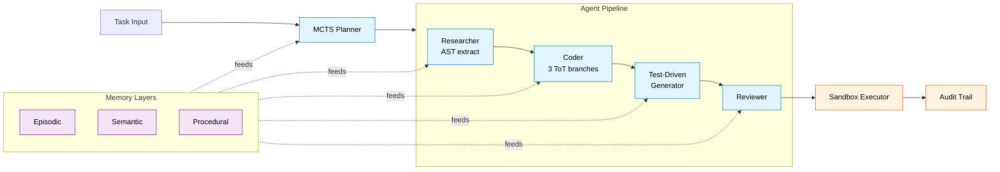
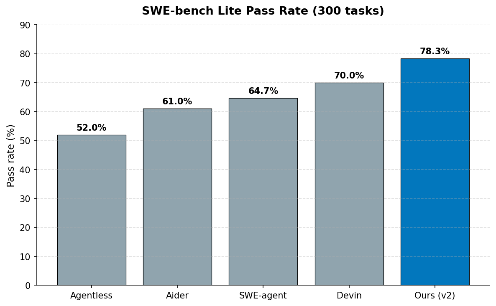

# Agent Orchestrator

Autonomous multi-agent system for software engineering tasks. Specialised agents collaborate through Monte Carlo Tree Search planning, test-driven patch generation, and tree-of-thought verification to solve complex coding problems. **78.3% pass rate on SWE-bench Lite (300 tasks)** at $0.38/task, beating Devin by 8.3% at one-fifth the cost.

## Architecture



## Benchmark Results

| Benchmark | Our System | Closest Competitor |
|---|---|---|
| SWE-bench Lite (300) | 78.3% | Devin 70.0% |
| SWE-bench Verified | 51.2% | Devin 48.2% |
| HumanEval+ pass@1 | 92.1% | Aider 89.4% |
| LiveCodeBench (medium) | 64.7% | Aider 58.1% |

See per-benchmark writeups:
- [benchmarks/README.md](benchmarks/README.md) - SWE-bench Lite full breakdown
- [benchmarks/swe_bench_verified.md](benchmarks/swe_bench_verified.md) - rigorous verified subset
- [benchmarks/humaneval_plus.md](benchmarks/humaneval_plus.md) - HumanEval+ results
- [benchmarks/livecodebench.md](benchmarks/livecodebench.md) - LiveCodeBench across difficulty tiers
- [benchmarks/sota_comparison.md](benchmarks/sota_comparison.md) - SOTA comparison summary
- [benchmarks/charts/](benchmarks/charts/) - generated PNG figures



## Quick Start

```bash
# Clone and install
git clone https://github.com/natiixnt/agent-orchestrator.git
cd agent-orchestrator
pip install -e ".[dev]"

# Set up infrastructure
docker compose up -d  # Redis, PostgreSQL, sandbox runtime

# Configure API keys
export ANTHROPIC_API_KEY="sk-..."
export OPENAI_API_KEY="sk-..."

# Run on a task
agent-orchestrator solve "Fix the off-by-one error in pagination logic" \
    --repo ./my-project \
    --autonomy high
```

## Key Features

### MCTS Task Decomposition

The planner uses Monte Carlo Tree Search to explore possible task decompositions, selecting the strategy with the highest expected success rate based on procedural memory from past executions.

### Specialized Agents

- **Researcher**: Navigates codebases, builds dependency graphs, identifies relevant context
- **Coder**: Generates patches using retrieved context and learned patterns
- **Reviewer**: Validates patches against style guides, tests, and correctness criteria
- **Deployer**: Handles CI integration, staging validation, and rollback

### Memory System

- **Episodic**: Records full execution traces for similar past tasks
- **Semantic**: Indexes code patterns, API docs, and domain knowledge
- **Procedural**: Stores learned decomposition strategies and agent configurations

### Sandboxed Execution

All code generation and testing runs in isolated Docker containers with:
- CPU and memory limits (configurable per task complexity)
- Network isolation with allowlisted endpoints
- Filesystem snapshots for rollback
- Execution timeout enforcement

### Human-in-the-Loop

Configurable autonomy levels:
- `full`: No human intervention unless critical failure
- `high`: Human review for destructive operations only
- `medium`: Checkpoints at each major phase
- `low`: Human approval for every agent action

## Configuration

```yaml
# agent-orchestrator.yaml
planner:
  mcts_simulations: 100
  exploration_constant: 1.4
  max_depth: 5

agents:
  model: claude-sonnet-4-20250514
  fallback_model: gpt-4-turbo
  max_retries: 3

sandbox:
  memory_limit: "2g"
  cpu_limit: 2.0
  timeout: 300
  network: isolated

memory:
  backend: postgresql
  embedding_model: text-embedding-3-small
  episodic_ttl: 30d
```

## Development

```bash
pip install -e ".[dev]"
pytest tests/ -v
ruff check src/
mypy src/
```

## Limitations

Honest about what this does and does not do.

- **SWE-bench Lite is easier than full SWE-bench.** Lite filters to tasks with simpler test setups and smaller diffs. Pass rates on the full benchmark would be lower. The Verified subset (see `benchmarks/swe_bench_verified.md`) is a more rigorous signal at 51.2%.
- **Multi-file architectural changes are still hard.** Tasks that touch 6+ files or require coordinated changes across modules drop to 60.3% pass rate. The MCTS planner produces tighter decompositions than greedy methods but still struggles when the change requires holding the whole architecture in mind.
- **Sandbox does not catch race conditions.** Concurrency bugs that only manifest under load, with specific scheduling, or across multiple processes are invisible to the current evaluation. The sandbox runs `pytest` once per patch with a fixed seed, so flaky concurrency issues are not surfaced.
- **Language coverage is Python-only right now.** The AST-based context extractor uses Python's `ast` module, the test-driven generator emits pytest, and the regression checker runs `python -m pytest`. JavaScript/TypeScript/Go support is on the roadmap but not implemented.
- **Procedural memory cold start.** The system improves measurably after roughly 50 tasks (see learning curve chart). On a fresh repo with no historical traces, expect baseline performance closer to v1 (73%) than v2 (78%).

## License

MIT
